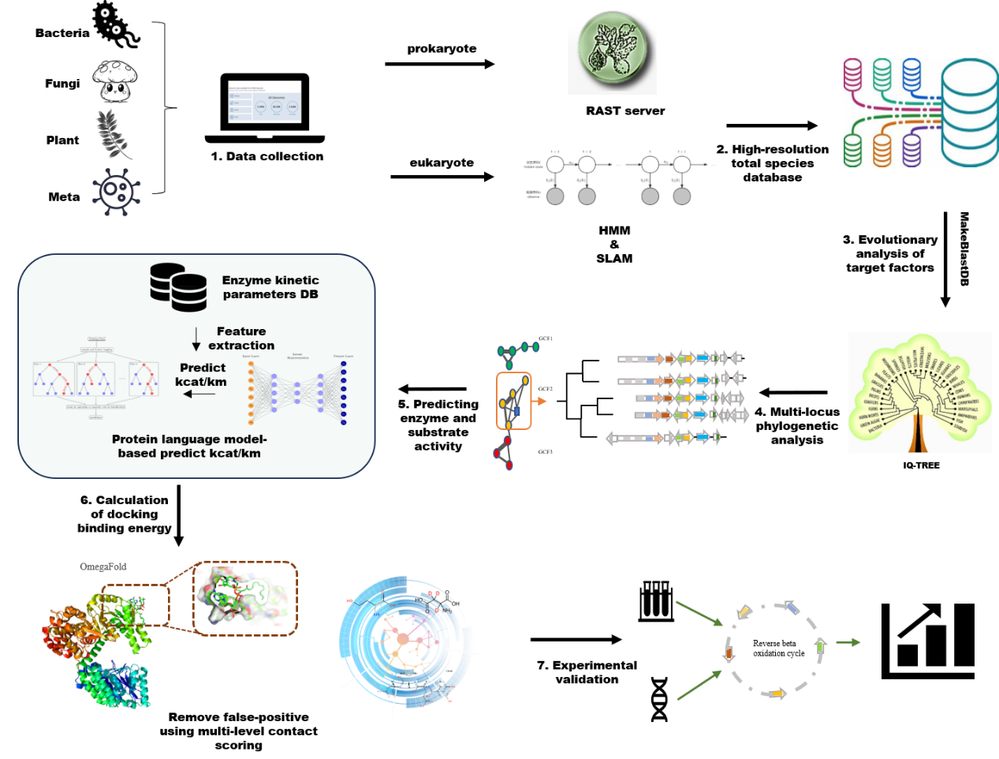
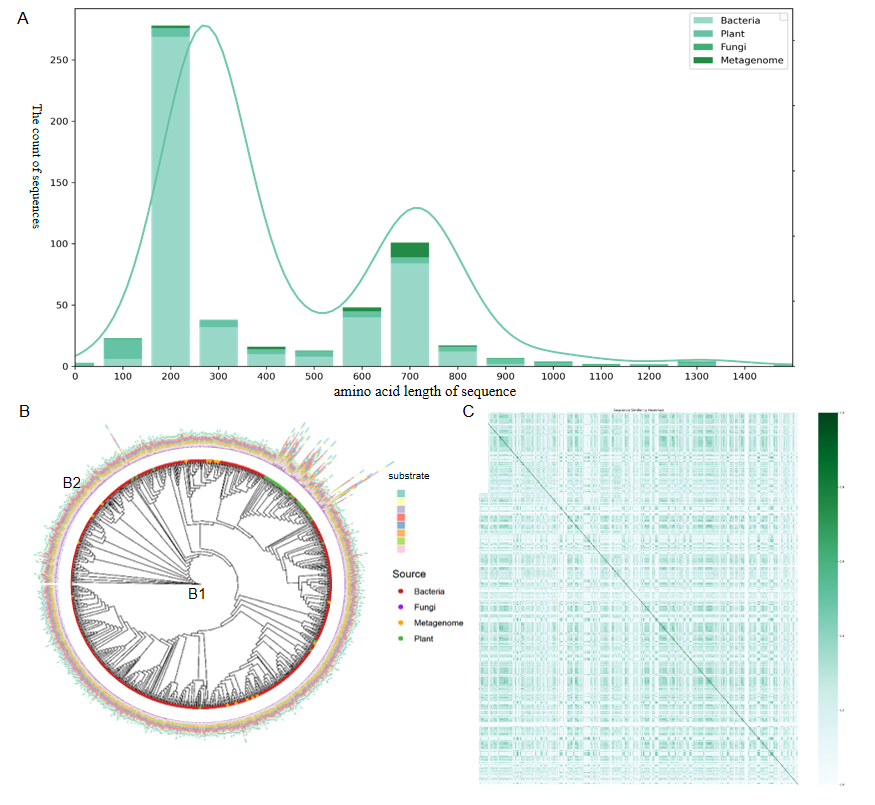
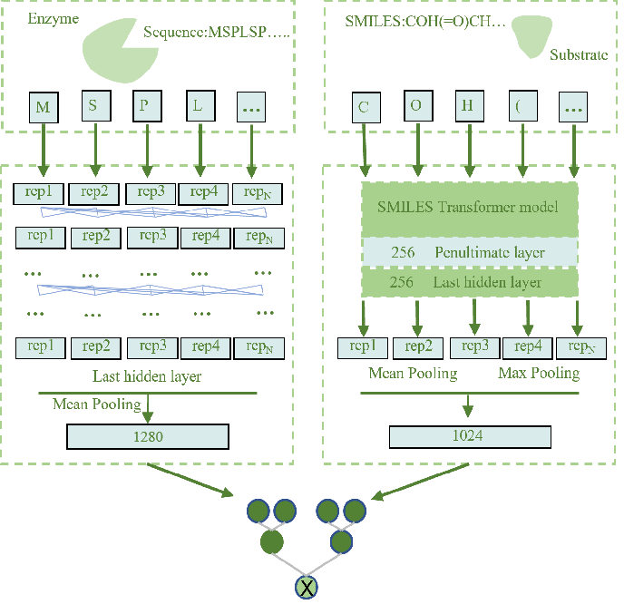

# Unlocking-Enzyme-Discovery

An integrated machine learning and bioinformatics pipeline for discovering scarce, high-value enzymes from vast, under-annotated genomic repositories.

## 📌 Overview
High-throughput sequencing has generated massive genomic datasets, yet the lack of precise annotation severely hampers enzyme discovery.  
This project presents a **robust, generalizable framework** that integrates phylogenetic analysis, protein language models, and multi-level contact scoring to identify and prioritize functional enzyme variants at scale.

---

### 🔄 Workflow


### 🌳 Evolutionary Analysis


### 🧠 Model Structure


---

## 🔬 Key Features
1. **High-resolution, cross-kingdom phylogenetic database**  
   - Covers bacterial, fungal, plant, and metagenomic sequences  
   - Avoids redundancy while maximizing evolutionary diversity  

2. **Multi-locus phylogenetic mining**  
   - Detects candidate enzymes via conserved multi-locus signatures  

3. **Evolutionary-scale protein language model prediction**  
   - Predicts enzyme activities directly from protein sequences  

4. **Multi-level residue–atom contact rescoring**  
   - Eliminates false positives from docking and enriches high-value hits  

## 📂 Repository Structure

data/ # Raw datasets and processed features
models/ # Trained models and saved weights
notebook/ # Jupyter Notebooks for training, analysis, and visualization
requirements.txt # Python dependencies

data/ # Raw datasets and processed features
models/ # Trained models and saved weights
notebook/ # Jupyter Notebooks for training, analysis, and visualization
requirements.txt # Python dependencies


## 🚀 Installation
```bash
git clone https://github.com/HLbiosynlab/Unlocking-Enzyme-Discovery.git
cd Unlocking-Enzyme-Discovery
pip install -r requirements.txt
```

##💡 Usage

Example: Running activity prediction
```

📓 For detailed workflows, analysis pipelines, and additional examples, please refer to the notebook/ folder.

```
##📜 Citation

If you use this work, please cite:

<Authors>. Unlocking Enzyme Discovery: An Integrated Pipeline for Large-Scale Functional Mining. <Yea
